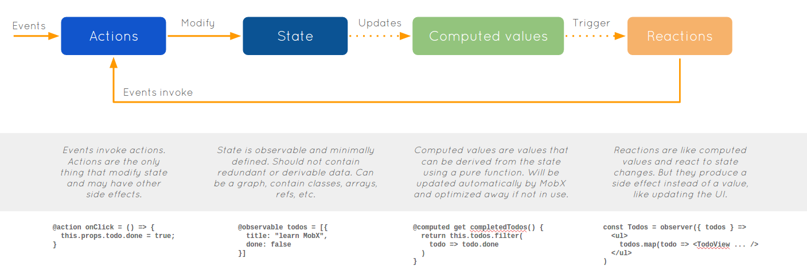

This project was bootstrapped with [Create React App](https://github.com/facebook/create-react-app).

- Christina
- Jason
- Joe
- Amberly

# What is Mobx?

Mobx is a state mangement library that works on the obersvable -oberserver flow (think how redux works on a high level). When using Mobx, you declare some data to be observable, and when that data changes, the observers that are "watching" that data are notified.

Mobx has functions called actions that are the only ones allowed to change state data. This practice improves code scalableity and improves data flow management.

Another core concept of Mobx is computed values, which are generated from calculations compared on core data. Think of how data is generated by formulas on spreadsheet programs. Again, this functionality from Mobx improves Code scalability.

# How do I run this app?

Runs the app in the development mode. 
Open [http://localhost:3000](http://localhost:3000) to view it in the browser.

The page will reload if you make edits. 
You will also see any lint errors in the console.

Click on the buttons to decrement or increment the counter.

Click on the message bubble in the lower right to turn on Mobx Devtools. Opening your browser's console will allow you to observe Mobx managing the app's state in real-time.

# Additional resources

- MobX Official tutorial: https://mobx.js.org/getting-started.html
- Getting started with Mobx https://medium.com/@shoaibbhimani1392/getting-started-with-mobx-82306df92d90 
- How to build your first app with Mobx and React https://hackernoon.com/how-to-build-your-first-app-with-mobx-and-react-aea54fbb3265
- When to use Redux vs. Mobx https://github.com/mobxjs/mobx/issues/199